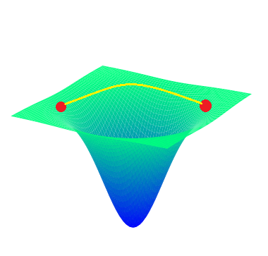
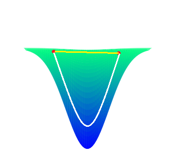
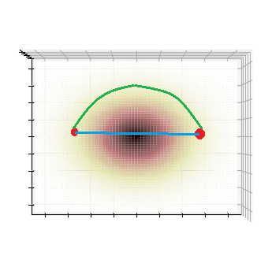

# Riemannian Normalizing Flow on WAE
Code for our NAACL2019 Paper "Riemannian Normalizing Flow on Variational Wasserstein Autoencoder for Text Modeling" https://arxiv.org/abs/1904.02399

Author: [Prince Zizhuang Wang](https://github.com/kingofspace0wzz/) and [William Yang Wang](http://www.cs.ucsb.edu/~william/)

<p align="center"></p>

<p align="center">
  
   
  
</p>
An example when latent space does not reflect input space. Left: a manifold that is highly curved in the central region. The yellow line is the geodesic (shortest) path connecting two sample points shown on the manifold. Right: The projection of manifold into 2D latent space, where the color brightness indicates curvature with respect to the manifold. The green line is the geodesic path if taking the curvature into account, while the blue line is the geodesic path if we regard latent space as Euclidean. Middle: The corresponding geodesic paths projected back from latent space to manifold. The white line corresponds to the straight geodesic path in Euclidean space. It is far longer than the true geodesic on manifold since it does not take the curvature into account in latent space.
<!-- 
   -->

## Running the code

### Requirements
* ``python 3.6``
* ``pytorch 1.0.0``
* ``spacy 2.0.12``
* ``torchtext 0.3.0``

### Training

train on ptb
```bash
$ python main.py --dist normal --kla --mmd --kernel im --flow --n_flows 3 --center --reg im --t 
0.8 --mmd_w 10 --data data/ptb
```

train on yahoo
```bash
$ python main.py --dist normal --embed_dim 512 --hidden_dim 1024 --kla --center --flow --mmd --t 0.8 --mmd_w 10 --reg im --data data/yahoo
```

train on yelp
```bash
$ python main.py --dist normal --kla --center --flow --mmd --t 0.8 --mmd_w 10 --reg im --data data/yelp
```

### Options
| Option        | Usage           | Value (Range) |
| ------------- |:-------------| :-----|
| kla | use kl annealing | True or False |
| center | use clusters to compute MMD | True or False |
| flow | use Normalizing Flow | True or False |
| MMD | use Wasserstein distance | True or False|
| enc_type | encoder model | lstm or gru |
| de_type | decoder model | lstm or gru |
| t | kl divergence weight | default = 0.8 |
| mmd_w | mmd weight | default = 10 |
| dist | choice of prior and posterior | normal or vmf|
| kernel | choice of kernel for mmd | g or im|
| reg | choice of kernel for rnf | g or im|

### Acknowledgement
* [Sentence VAE, Bowman](https://arxiv.org/abs/1511.06349)
* [von-Mises Fisher VAE, Xu](https://arxiv.org/abs/1808.10805)
* [Dirichlet VAE for Text Modeling, Xiao](https://arxiv.org/abs/1811.00135)
* [Dilated Convolutional VAE, Yang](https://arxiv.org/abs/1702.08139)

<!-- ## Reference

'''

''' -->
